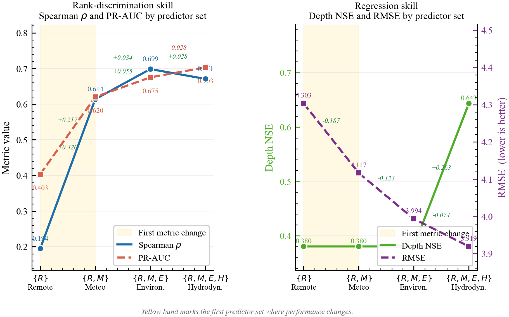

# PADR-Net

[](https://www.python.org/downloads/)
[](https://creativecommons.org/licenses/by/4.0/)
[](https://doi.org/10.5281/zenodo.20642121)
[](https://base-attentive.readthedocs.io/en/latest/padrnet.html)

**Physics-Aware Deep Reservoir Network for African Flood Impact Prediction**

PADR-Net combines an Echo State Network (ESN) reservoir with a
shallow-water-equation (SWE) physics penalty to jointly predict flood
inundation depth and socioeconomic severity.  The two-head architecture
separates physics-constrained depth reconstruction from severity ranking,
proving that the physics weight λ can be tuned independently of severity
performance (Proposition 1).

> Kouadio, K. L. (2026). A Physics-Informed Deep Learning Framework for
> African Flood Impact Prediction. *Mathematical Geosciences* (submitted).
> DOI: [10.5281/zenodo.20642121](https://doi.org/10.5281/zenodo.20642121)

---

## Architecture

```
Input features  x_i ∈ R^d
      │
      ▼
  ESN Reservoir  (W_in, W_res fixed — echo state property)
      │
      ▼
  Reservoir summary  s_i = [x_{i,T}; x̄_i]
      │
      ├──────────────────────┐
      ▼                      ▼
  Depth head               Severity head
  [s_i | x^H_i]            [s_i | x^(j)_i]
  Ridge(α_λ)               Ridge(α_0)
  α_λ = α_0 + λ·ℓ_phys/Var(D)
      │                      │
      ▼                      ▼
  log(max_depth)         log1p(severity)
```

The SWE physics penalty enters **only** the depth head through augmented
regularisation α_λ.  The severity head is invariant to λ (Proposition 1).

Full architecture diagram: [`results/figures/fig03_architecture.png`](results/figures/fig03_architecture.png)

---

## Key results

| Model | Predictor set | Spearman ρ | PR-AUC | NSE_depth | MAE |
|---|---|---|---|---|---|
| M0 | R — rainfall only | 0.194 | 0.403 | 0.380 | 3.891 |
| M1 | R + M — antecedent memory | 0.614 | 0.620 | 0.380 | 3.749 |
| M4 | R + M + E — exposure | 0.699 | 0.675 | 0.380 | 3.642 |
| **M6** | **R + M + E + H — full (λ\*=0.1)** | **0.671** | **0.703** | **0.643** | **3.569** |

243 flood events · 3 African river basins · 2000–2024



---

## Quick start

Reproduce all publication figures from pre-computed tables — no downloads required.

```bash
git clone https://github.com/earthai-tech/padrnet
cd padrnet
conda env create -f environment.yml
conda activate padrnet
python scripts/06_make_figures.py
```

Figures are written to `results/figures/` as PNG.

---

## Full pipeline

Scripts 01–03 require external datasets (see `data/raw_public_links/download_sources.csv`).
Scripts 04–06 run fully self-contained on the pre-computed tables in `data/`.

```bash
# 1 — Audit available data layers
python scripts/01_africa_data_audit.py

# 2 — Build the 243-event flood inventory (needs EM-DAT + GFD)
python scripts/02_build_africa_event_table.py

# 3 — Extract ERA5 climate features (~7 GB download)
#     See data/raw_public_links/ERA5_DOWNLOAD.md
python scripts/03_build_era5_covariates.py

# 4 — Train PADR-Net + run M0–M8 ablation + LORO/LOYO transfer
python scripts/04_padrnet_training.py

# 5 — Generate flood scenario time series
python scripts/05_make_flood_scenarios.py

# 6 — Generate all 14 publication figures
python scripts/06_make_figures.py

# Or run everything at once
python scripts/run_all.py
```

---

## Repository structure

```
padrnet/
├── scripts/                    # Analysis pipeline (01–06) + diagnostics
│   ├── common.py               # Shared paths and region definitions
│   ├── 01_africa_data_audit.py
│   ├── 02_build_africa_event_table.py
│   ├── 03_build_era5_covariates.py
│   ├── 04_padrnet_training.py
│   ├── 05_make_flood_scenarios.py
│   ├── 06_make_figures.py
│   └── run_all.py
├── configs/
│   └── padrnet_config.py       # All hyperparameters in one place
├── data/
│   ├── processed/              # era5_covariates.csv, data_audit_africa.csv
│   ├── africa_event_table/     # 243-event flood inventory
│   ├── metadata/               # training snapshot, extraction reports
│   └── raw_public_links/       # download_sources.csv, ERA5_DOWNLOAD.md
├── results/
│   ├── tables/                 # ablation, nested, lambda, transfer, bootstrap
│   └── figures/                # all 14 publication figures (PNG)
├── environment.yml
├── requirements.txt
├── LICENSE                     # CC-BY 4.0
└── CITATION.cff
```

---

## Data availability

| Dataset | Role | Availability |
|---|---|---|
| EM-DAT flood inventory | Event labels (deaths, displaced, damage) | [emdat.be](https://www.emdat.be) — register free |
| Global Flood Database | Satellite flood extent | [cloudtostreet.ai](https://global-flood-database.cloudtostreet.ai) — register free |
| ERA5 reanalysis | Climate covariates (7 variables) | [Copernicus CDS](https://cds.climate.copernicus.eu) — free |
| Pre-computed feature tables | Direct training input for scripts 04–06 | This repo — `data/processed/` |

ERA5 raw files (~7 GB) are not included. See `data/raw_public_links/ERA5_DOWNLOAD.md`
for step-by-step download instructions. The extracted feature table
`data/processed/era5_covariates.csv` is already included — sufficient to
reproduce all model results without downloading ERA5.

---

## Hyperparameters

All model hyperparameters are in [`configs/padrnet_config.py`](configs/padrnet_config.py).
Key settings:

| Parameter | Value | Description |
|---|---|---|
| `N_res` | 200 | Reservoir size |
| `spectral_radius` | 0.90 | ESN spectral radius |
| `leaking_rate` | 0.25 | Leaky integration rate |
| `sparsity` | 0.12 | Reservoir connection sparsity |
| `ridge_alpha` | 1e-3 | Base ridge regularisation α₀ |
| `lambda_opt` | 0.10 | Optimal physics weight λ* |
| `ts_length` | 168 | Input time-series length (hours) |

---

## Documentation

Full API reference and usage guide:
**[base-attentive.readthedocs.io/en/latest/padrnet.html](https://base-attentive.readthedocs.io/en/latest/padrnet.html)**

The PADR-Net model is part of the broader
[Base-Attentive](https://github.com/earthai-tech/base-attentive) framework
for attention-based and hybrid time-series models.

---

## Citation

```bibtex
@software{Kouadio2026padrnet_code,
  author    = {Kouadio, Kouao Laurent},
  title     = {PADR-Net: Physics-Aware Deep Reservoir Network
               for African Flood Impact Prediction},
  year      = {2026},
  publisher = {Zenodo},
  doi       = {10.5281/zenodo.20642121},
  url       = {https://github.com/earthai-tech/padrnet}
}

@article{Kouadio2026padrnet_paper,
  author  = {Kouadio, Kouao Laurent},
  title   = {A Physics-Informed Deep Learning Framework for
             African Flood Impact Prediction},
  journal = {Mathematical Geosciences},
  year    = {2026},
  note    = {Submitted}
}
```

---

## Contact

Kouao Laurent Kouadio — [lkouadio.com](https://lkouadio.com/) — [etanoyau@gmail.com](mailto:etanoyau@gmail.com)  
EarthAI Tech — [github.com/earthai-tech](https://github.com/earthai-tech)
